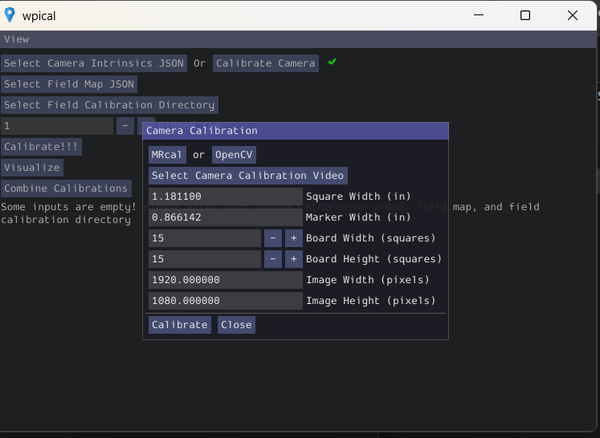

# How to Generate a Field Map with WPICal

.fmap files are for Limelight only, we don't use them in PhotonVision

Camera Calibration Details:
- Square Width (in): 1.1811
- Marker Width (in): 0.866142
- Board Width (squares): 15
- Board Height (squares): 15
