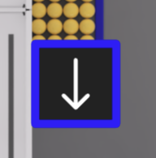
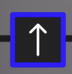
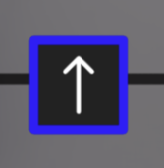
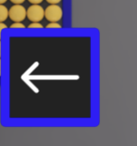
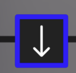

# Autonomous Rotation in Simulation
## a smaller header (hehe)
### Important X/Y Values
- X is 40
- 
### Blue Center Pose  
- X is 2, Y is 4, Rotation is 90
- 

### Rotation Values for Autopilot Commands
- 0
- 
- 90
- 
- 180
- 
- 270
- 