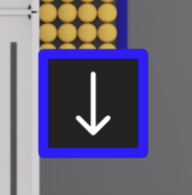
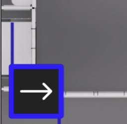
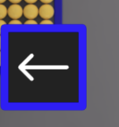

# Autonomous Rotation in Simulation
## a smaller header (hehe)
### Important X/Y Values
- X is 40
- 
### Blue Center Pose  
- X is 2, Y is 4, Rotation is 90
- 

### Rotation Values for Autopilot Commands
- 0
- 
- 90
- 
- 180
- 
- 270
- 

        private static double RIGHT_START_HARVEST_HORIZONTAL_POINT = Finney: 3; //Field: 1
        private static double RIGHT_END_HARVEST_HORIZONTAL_POINT = Finney 5.0; //field: 6
        private static double LEFT_START_HARVEST_HORIZONTAL_POINT = Finney 6; //field was 7
        private static double LEFT_END_HARVEST_HORIZONTAL_POINT = Finney 2.5; //field was 2