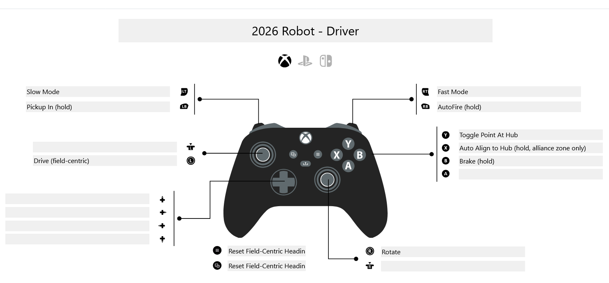
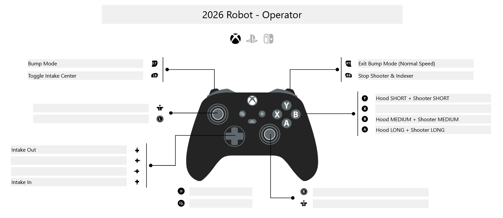

# Controller Layouts — Team 1405 · 2026 Robot

Quick reference for all driver and operator button bindings.  
Click either image for the live interactive layout on PadCrafter.

---

## 🎮 Driver Controller (Xbox · Port 0)

[](https://www.padcrafter.com/?templates=2026+Robot+-+Driver&plat=0&leftTrigger=Slow+Mode+%2820%25%29&rightTrigger=Fast+Mode+%28100%25%29&leftBumper=Pickup+In+%28hold%29+%2F+Stop+on+release&rightBumper=AutoFire+%28hold%29+%2F+Stop+Indexer+on+release&bButton=Brake+%28hold%29&xButton=Auto+Align+to+Hub+%28hold+%E2%80%94+alliance+zone+only%29&yButton=Toggle+Point+At+Hub&leftStick=Drive+%28field-centric%29&rightStick=Rotate&startButton=Reset+Field-Centric+Heading+%28%2B+Back%29&backButton=Reset+Field-Centric+Heading+%28%2B+Start%29)

| Input | Action | Notes |
|---|---|---|
| **Left Stick** | Drive (field-centric) | X/Y translation |
| **Right Stick** | Rotate | Standard rotation mode |
| **Left Trigger** | Slow Mode | 20% of max speed |
| **Right Trigger** | Fast Mode | 100% of max speed |
| LT **or** RT released | Return to Normal Mode | 60% of max speed |
| **Left Bumper** (hold) | Pickup In | Stops on release |
| **Right Bumper** (hold) | AutoFire | Stops indexer on release |
| **B** (hold) | Brake | Swerve lock |
| **X** (hold) | Auto Align to Hub | Alliance zone only |
| **Y** | Toggle Point At Hub | STANDARD ↔ POINT (or POINT\_VEL\_COMP — see dashboard switch) |
| **Start + Back** | Reset Field-Centric Heading | Both simultaneously |

### Speed Mode Reference

| Trigger State | Mode | Speed |
|---|---|---|
| Neither pressed | Normal | 60% |
| Left Trigger only | Slow | 20% |
| Right Trigger only | Fast | 100% |

### Point Mode Feature Switch

The **Y button** toggles between STANDARD rotation and point-at-hub aiming.  
Which point mode activates is controlled by a live toggle in **Elastic Dashboard**:

```
NetworkTables key: /SmartDashboard/MoveMode/Use Velocity Compensated Point
  false (default) → POINT          (line-of-sight aim)
  true            → POINT_VELOCITY_COMPENSATED  (leads target based on robot velocity)
```

---

## 🎮 Operator Controller (Xbox · Port 1)

[](https://www.padcrafter.com/?templates=2026+Robot+-+Operator&plat=0&leftTrigger=Bump+Mode+%28auto-holds+heading+for+crossing%29&rightTrigger=Exit+Bump+Mode+%28Normal+Speed%29&leftBumper=Toggle+Intake+Center&rightBumper=Stop+Shooter+%26+Indexer&aButton=Hood+LONG+%2B+Shooter+LONG+Speed&bButton=Hood+MEDIUM+%2B+Shooter+MEDIUM+Speed&yButton=Hood+SHORT+%2B+Shooter+SHORT+Speed&dpadUp=Intake+Out&dpadDown=Intake+In)

| Input | Action | Notes |
|---|---|---|
| **D-Pad Up** | Intake Out | Ejects game piece |
| **D-Pad Down** | Intake In | Pulls game piece in |
| **Y** | Hood SHORT + Shooter SHORT speed | Close-range shot preset |
| **B** | Hood MEDIUM + Shooter MEDIUM speed | Mid-range shot preset |
| **A** | Hood LONG + Shooter LONG speed | Long-range shot preset |
| **Right Bumper** | Stop Shooter + Stop Indexer | Emergency stop for shooter |
| **Left Bumper** (toggle) | Intake Center | Toggles centering mode |
| **Left Trigger** | Bump Mode | Auto-holds heading to cross bump backwards |
| **Right Trigger** | Exit Bump Mode | Returns to Normal speed mode |

### Bump Mode Details

When Bump Mode is active the robot:
1. **Speed** — enforces a minimum speed (35%) to clear the bump, capped at 60%.
2. **Heading** — automatically holds 0° or 180° (alliance-relative) so the robot always enters the bump **backwards**.
3. **Override** — driver can still override the heading hold by pushing the right stick past 15% deflection.

| Robot Location | Blue Alliance Target | Red Alliance Target |
|---|---|---|
| Alliance Zone side | 0° | 180° |
| Neutral Zone side | 180° | 0° |

---

## PadCrafter Links

| Layout | Interactive Link |
|---|---|
| Driver | [Open in PadCrafter](https://www.padcrafter.com/?templates=2026+Robot+-+Driver&plat=0&leftTrigger=Slow+Mode+%2820%25%29&rightTrigger=Fast+Mode+%28100%25%29&leftBumper=Pickup+In+%28hold%29+%2F+Stop+on+release&rightBumper=AutoFire+%28hold%29+%2F+Stop+Indexer+on+release&bButton=Brake+%28hold%29&xButton=Auto+Align+to+Hub+%28hold+%E2%80%94+alliance+zone+only%29&yButton=Toggle+Point+At+Hub&leftStick=Drive+%28field-centric%29&rightStick=Rotate&startButton=Reset+Field-Centric+Heading+%28%2B+Back%29&backButton=Reset+Field-Centric+Heading+%28%2B+Start%29) |
| Operator | [Open in PadCrafter](https://www.padcrafter.com/?templates=2026+Robot+-+Operator&plat=0&leftTrigger=Bump+Mode+%28auto-holds+heading+for+crossing%29&rightTrigger=Exit+Bump+Mode+%28Normal+Speed%29&leftBumper=Toggle+Intake+Center&rightBumper=Stop+Shooter+%26+Indexer&aButton=Hood+LONG+%2B+Shooter+LONG+Speed&bButton=Hood+MEDIUM+%2B+Shooter+MEDIUM+Speed&yButton=Hood+SHORT+%2B+Shooter+SHORT+Speed&dpadUp=Intake+Out&dpadDown=Intake+In) |
